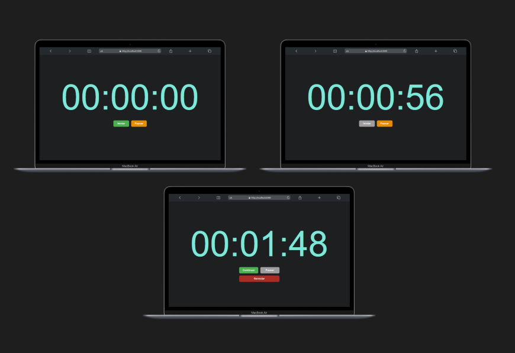
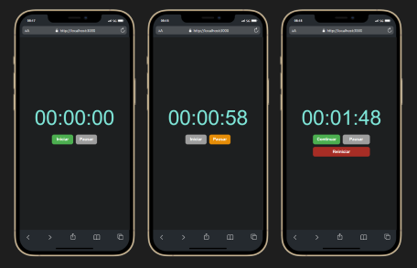
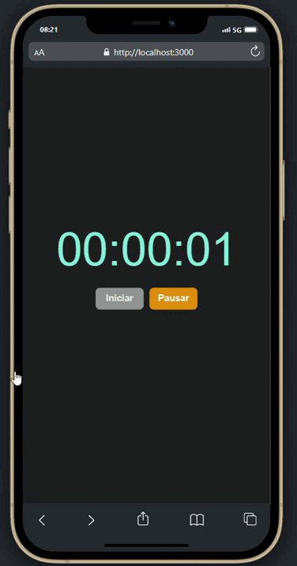

# Cronômetro

Este é um projeto simples de cronômetro com funcionalidades de iniciar, pausar e reiniciar.

### Demonstrações

| Tipo                     | Imagem                                                      |
| ------------------------ | ----------------------------------------------------------- |
| **Demonstração Desktop** |  |
| **Demonstração Mobile**  |   |
| **Funcionando**          |                 |

## Funcionalidades

- **Iniciar**: Ao clicar em "Iniciar", a contagem do cronômetro começa.
- **Pausar**: Permite pausar o cronômetro no tempo atual.
- **Continuar**: Uma vez pausado, a opção iniciar vira 'continuar'.
- **Reiniciar**: Reseta o cronômetro e reinicia a contagem.

## Tecnologias Usadas

- **HTML**: Estrutura básica da página.
- **CSS**: Estilo, responsividade e interatividade de transições.
- **JavaScript**: Lógica de controle do cronômetro e interações com os botões.

### Como Rodar o Projeto

1. Clone este repositório:

```bash
git clone https://github.com/IzabelleAlves/Cronometro.git
```

2. Navegue até o diretório do projeto:

```bash
cd cronometro
```

3. Abra o arquivo `index.html` no seu navegador para visualizar o cronômetro em funcionamento.

Se você tiver sugestões de melhorias, fique à vontade para abrir uma issue ou enviar um pull request!!

**_Entre em contato comigo_**

- **E-mail**: [izabelle.alvesbl@gmail.com](mailto:izabelle.alvesbl@gmail.com)
- **LinkedIn**: [Izabelle Alves](https://www.linkedin.com/in/izabellealvess/)
